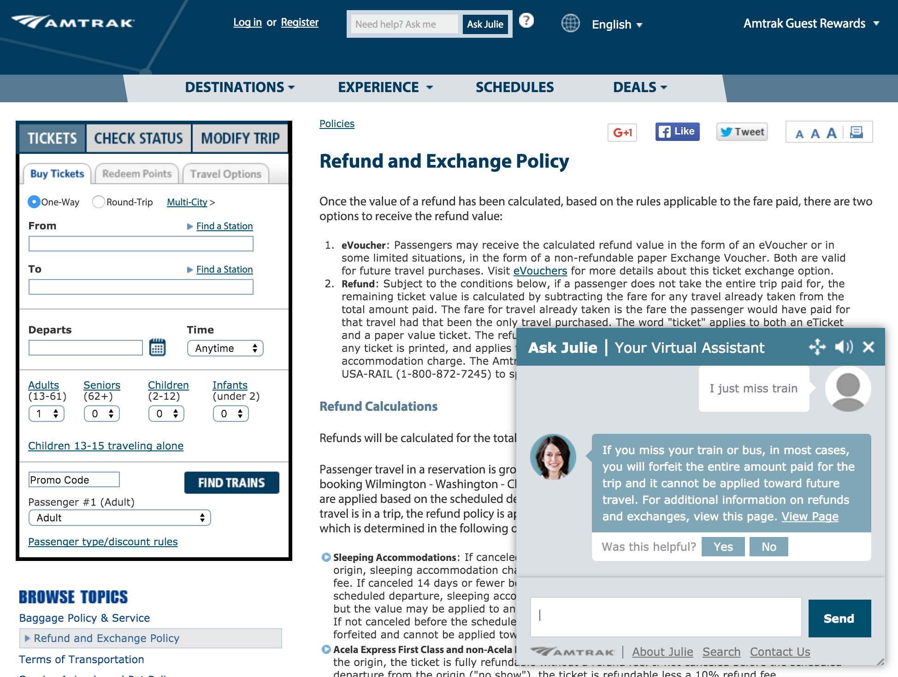
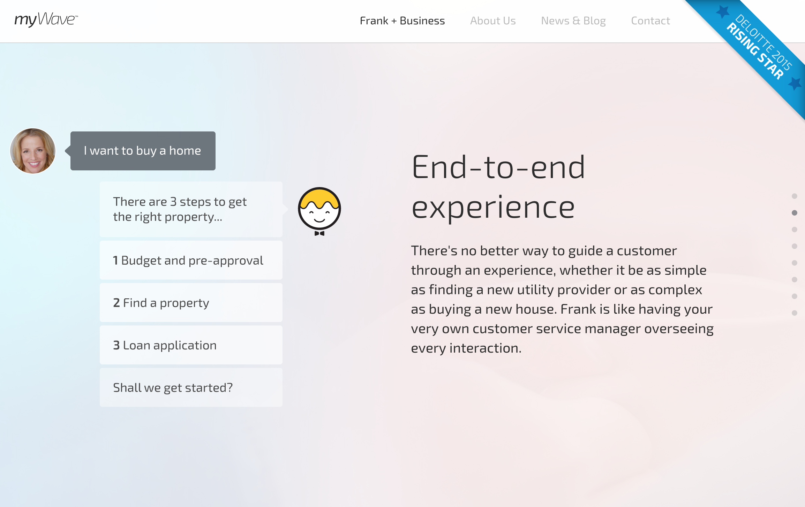

향후 발전 방향
======================

온라인 상담 시스템인 `STALK`와 같은 서비스는, 기본적으로 콜센터 또는 온라인 상담조직의 상담사(Operator)를 통해 고객과 상담하도록 되어 있습니다.
좀 더 발전된 온라인 상담시스템은, 상담원의 직접 상담뿐 아니라 자동응답을 기반으로 하는 Intelligent Assistant 또는 Virtual Assistant 로 발전될 수 있습니다.

온라인 상담 서비스는 상담을 원하는 고객이 늘어날 수록 상담사(Operator)의 수도 증가해야 하므로 운영 비용이 증가하게 되고, 즉답의 어려움으로 품질이 떨어질 수 밖에 없습니다. 그러므로 최대한 효율적으로 응대하고 비용을 최소화 하기 위하여 자동응답과 같은 기능이 필요하게 됩니다.

FAQ(Frequently asked questions)와 같이 미리 정의할 수 있는 질문에 대한 답변을 온라인 상담 시스템에 미리 등록하고, 해당하는 질문을 받았을 경우 자동응답하게 하는 것입니다.


**AMTRAK** - [http://www.amtrak.com](http://www.amtrak.com)

미국의 국립 철도 서비스 사이트로, 고객의 질문에 가상 상담원과 온라인 상담원이 함께 상담하게 됩니다.  



상단 중앙에 `Ask Julia` 부분에 질문을 입력하면, 가상의 상담원 Julia 가 자동응답하게 되고, 만약 자동응답이 불가능할 경우 온라인 상담사가 응대하게 됩니다.

**myWave** - [https://mywave.me](https://mywave.me)

가상 또는 온라인 상담사가 고객별 개인 맞춤 비서혁할을 하는 서비스 입니다. 대부분의 질문이나 일정 알림에 대해서는 가상의 비서 (Virtual Secretary)가 응대하고, 가상의 자동응답 비서가 처리 하지 못하는 건에 대해서는 온라인 상담사가 직접 처리하도록 되어 있습니다.




```
TODO 내용 추가 필요!


- 질문에 대한 답 목록을 정해 놓고, 범위에 들어가면 자동 답변
- FAQ 수준 부터 시작
- 상담원이 단순 응대이면서 시간이 많이 드는 것!


 - amtrak.com(화면 이동하고, 다시 Agent 실행)
 - Alaska Airline
 - fiat.com.ar (apenbot)
 - Ticket Master (특정 시간 아무것도 안하고 있으면 agent 를 실행)
 - myWave (Digital Assistant, 개인비서의 역할)
 - US Bank (앱 실행 초기 단계에서 음성인식으로 모든 메뉴에 접근할 수 있도록, 자연어 분석 / NLP)

**특징**
 - 말만 하면 무엇이든지 처리해주는 —> Zero Interface !!!
 - VA 가 있다고 해서 상담원 일이 줄어들지 않을 수 있다. 다만, 고객의 구매유도를 더욱 증대 시킬 수 있다.

등등등..
```
