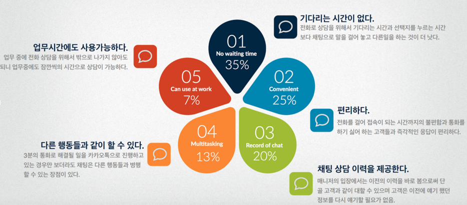
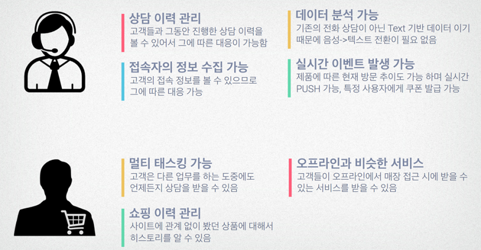

STALK
======================

## STALK의 추진 배경

온라인 채팅 상담 서비스의 수요는 모바일 메신져가 성장하게 된 원인과 같다고 할 수 있습니다. 사용자들이 전화대신 채팅을 선호하는 주요 이유로는 기다리는 시간이 없고, 편리하고, 다른 행동과 함께 병행할 수 있다는 점등을 뽑을 수 있습니다. 이렇게 물건을 사기전에 채팅을 이용하여 상담을 원하는 사용자의 요구와 이 사용자들과 새로운 경험을 하기를 원하는 쇼핑몰 운영자들을 위해 STALK이라는 서비스를 개발하게 되었습니다.

## STALK의 주요 기능

STALK의 주요 기능으로는 아래와 같은 것들이 있습니다.

 - 사이트에 접속한 모든 고객과 실시간으로 채팅이 가능합니다.

 - 고객의 정보와 상담이력을 확인하면서 응대가 가능합니다.

 - 접속한 고객들의 정보를 실시간으로 분석이 가능하기 때문에 분석 도구로써 더욱 효율적입니다.

 - 상품을 보고 있는 고객의 화면에 실시간 프로모션을 전송할 수 있습니다.

 