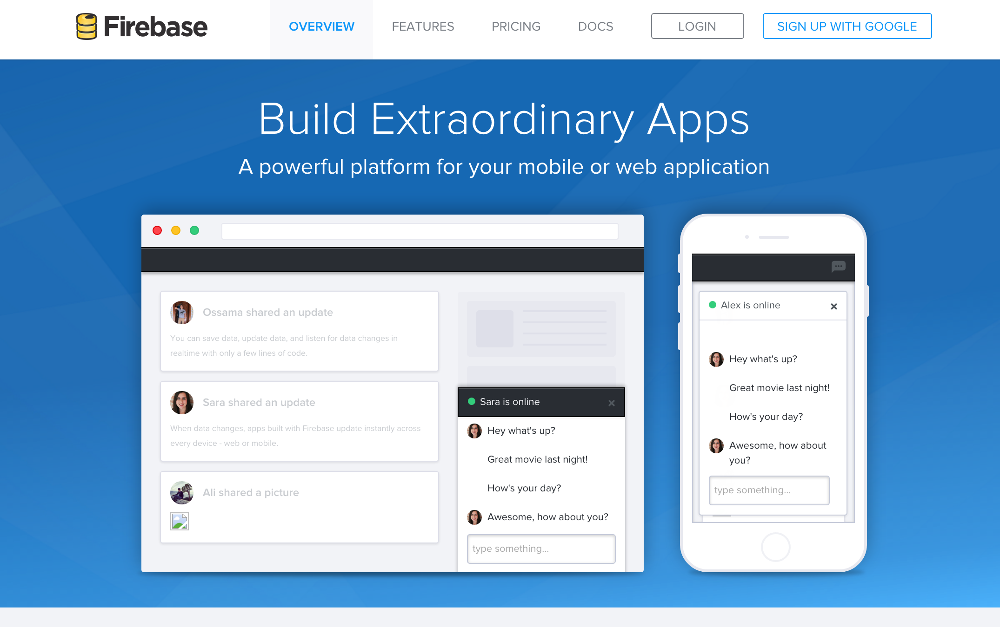
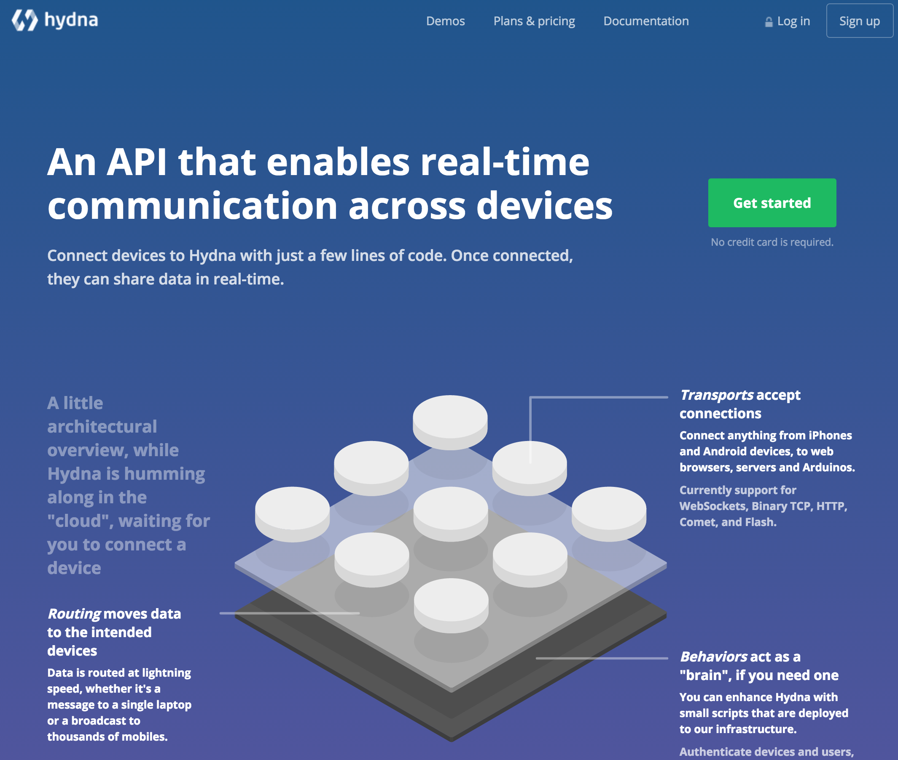

유사 플랫폼 사례
======================

실시간 서비스를 개발하기 위하여 사용할 수 있는 개발 플랫폼들은 대부분 사용한 만큼 과금하는 방식으로 운영되고 있습니다.

대표적으로 Google 이 인수한 [Firebase](https://www.firebase.com)는 범용적인 개발 플랫폼으로 실시간 서비스를 개발할 수 있도록 하는 다양한 기능을 제공하고 있습니다. 개발 편의를 위하여 다양한 Javascript 라이브러리를 지원하고 있으며, IOS 나 Android 라이브러리를 제공하여 어렵지 않게 실시간 서비스를 구현할 수 있도록 하고 있습니다.

이와 비슷한 실시간 서비스 개발 플랫폼으로 [hydna](https://www.hydna.com)가 있으며, 서버 개발 없이도 채팅과 같은 실시간 메시징 기능을 구현할 수 있도록 지원하고 있습니다. 마찮가지로 다양한 라이브러리를 지원하고 있어 어렵지 않게 개발할 수 있습니다.

위의 실시간 플랫폼은 저렴한 비용으로 실시간 서비스를 구현할 수 있는 반면에, 직접 설치하여 운영하지 않고 서비스 형태로 사용하는 것으로, 송수신 데이터를 자체적으로 저장하여 향후 분석하거나 다를 의미 있는 용도로 활용하기 어려운 점이 있을 수 있습니다.

`XPUSH` 플랫폼은 오픈소스로 배포되어 직접 설치하여 운영할 수 있고, 저장된 메시지들을 기반으로 데이터 분석 및 다른 서비스로 활용할 수 있습니다. 또한, 타 시스템이나 솔루션과의 연계를 직접 구현할 수 있어 다양한 서비스로 확장될 수 있습니다.
