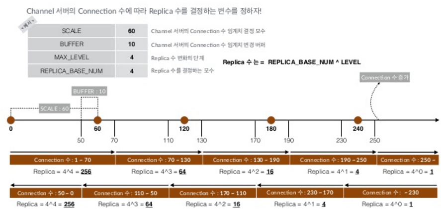
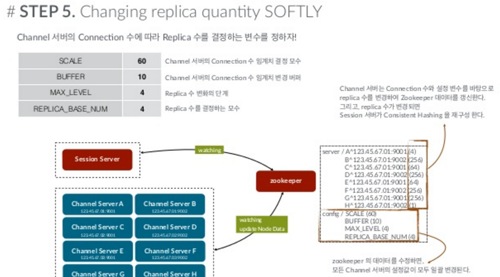

부하 분산 방법
======================

### 채널내 접속자수의 증가

사용자가 일정이상 증가하면, Consistent Hash Ring에서 Replica 수를 감소시킵니다.

Replica 수가 작아진 만큼 해당 서버로 할당받을 확률이 줄어들게 되기 때문에 부하 분산이 가능해집니다.

채널 내 접속자 수는 는 단계별로 이루어지고, 단계에 따라 Replica도 조절해서 유려한 부하 분산이 가능하도록 설계되어 있습니다.

### 채널내 접속자의 감소

사용자가 일정수 이하로 감소하면, Consistent Hash Ring에서 Replica 수를 증가시킵니다.

Replica 수가 증가한만큼 다른 서버와 동일한 조건으로 부하 분산이 이루어질 것입니다.

