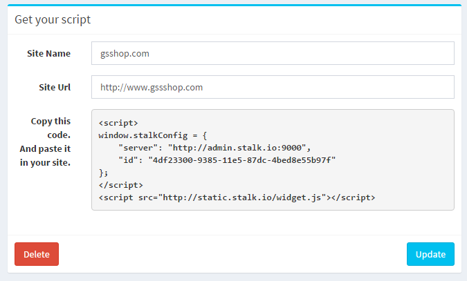

위젯 적용
======================

운영자 메뉴에서 사이트 등록을 완료했다면, 아래와 같은 script 를 볼 수 있습니다.



해당 코드를 운영중인 html page의 하단에 추가하면, 위젯 적용이 완료됩니다.

```html
<html>
<body>
	<div>
		Sample Page
	</div>
	<script>
	window.stalkConfig = {
		"server": "http://admin.stalk.io:9000",
		"id": "4df23300-9385-11e5-87dc-4bed8e55b97f"
	};
	</script>
	<script src="http://static.stalk.io/widget.js"></script>
</body>
<html>
```