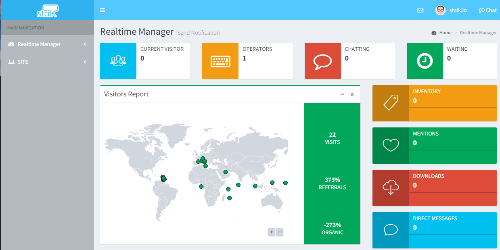
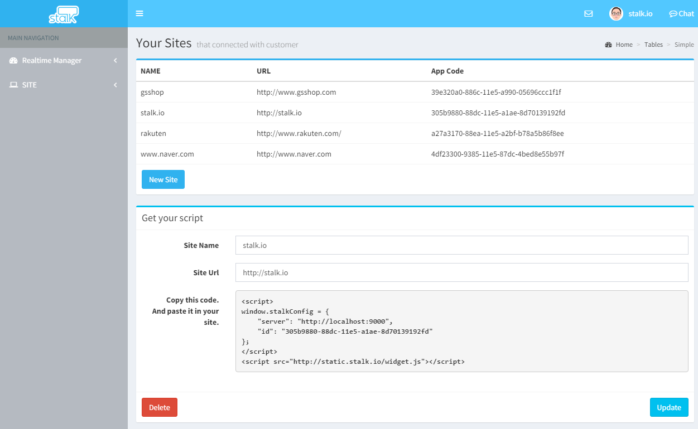

Admin Server
======================

STALK 서비스를 사용하는 운영자들을 위한 Web Application 입니다.

이메일과 패스워드를 사용하여 회원가입을 하도록 되어 있습니다.

로그인 이후에는 Dashboard 화면과 Chat 화면으로 구성되어 있습니다.

## Dashboard

Dashboard 화면은 Realtime Manager와 Site 메뉴로 구성되어 있습니다.

### Realtime Manager 

이 화면에서는  현재 접속 중인 operator의 수와 현재 접속 중인 사용자의 수를 확인할 수 있습니다.

### Site

이 화면에서는 현재 접속 중인 유저가 관리하고 있는 Site의 리스트를 확인하고, 새로운 사이트의 정보를 추가하거나 수정, 삭제할 수 있습니다.

#### Site 등록
site 등록 시에는 NAME과 URL을 등록하도록 되어 있습니다. 여기서 URL은 여러분의 사이트의 루트 URL을 입력해야합니다. 등록 후 발급되는 app code 를 사용하여 등록한 사이트에 특정 코드를 추가하면, 접속 중인 operator와 채팅을 할 수 있도록 됩니다. **Site 등록하거나 수정할 때 URL을 정확히 입력하는 것** 이 가장 중요합니다.

## Chat

### 채팅 리스트

Dashboard 화면에서 우측 상단의 Chat 이미지를 클릭하면 고객과 채팅할 수 있는 화면으로 이동합니다.

왼쪽 영역에는 관리 중인 사이트의 리스트와 해당 사이트에서 대화를 원하는 사용자의 리스트가 표시됩니다.

사용자 이름을 클릭하면 해당 사용자와 채팅을 시작할 수 있습니다.

### 고객 정보

오른쪽 영역에는 채팅을 하고 있는 사용자의 정보가 표시됩니다.

채팅을 시작한 시간, 접속 중인 사이트의 URL, 사용 중인 OS와 Browser, IP와 현재 위치 등을 확인 할 수 있습니다.

[여기](http://admin.stalk.io:9000/dashboard)에서 실제로 테스트해볼 수 있습니다.