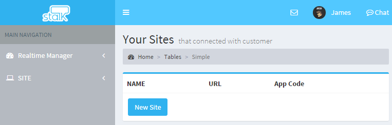
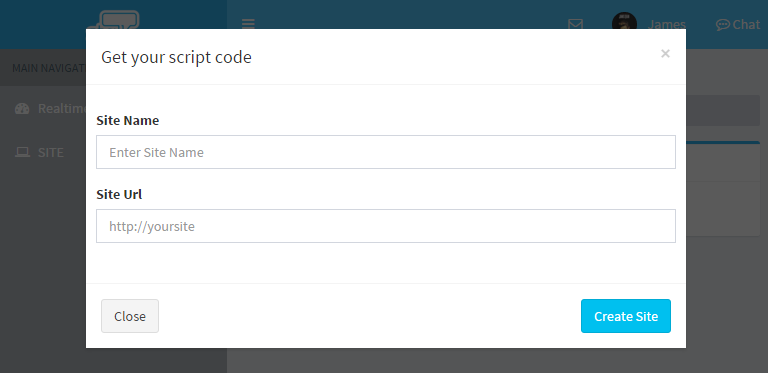
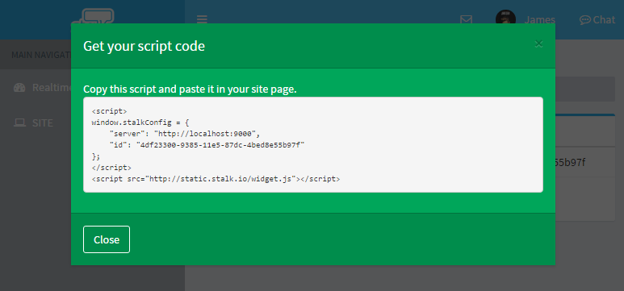

위젯 생성
======================

1. site 메뉴로 들어가서 `New Site` 버튼을 클릭합니다.

2. Site Name 과 Site Url 을 입력하고 `Create Site` 버튼을 클릭합니다.

site url은 `http://`로 시작되도록 정확하게 입력해야합니다.

**Site 등록하거나 수정할 때 URL을 정확히 입력하는 것** 이 가장 중요합니다.

3. Site 등록이 완료되면, 아래 그림과 같이 script code가 생성됩니다.

아래의 코드를 위에서 등록한 사이트에 추가하면, 채팅 상담을 지원할 준비가 모두 끝납니다.

